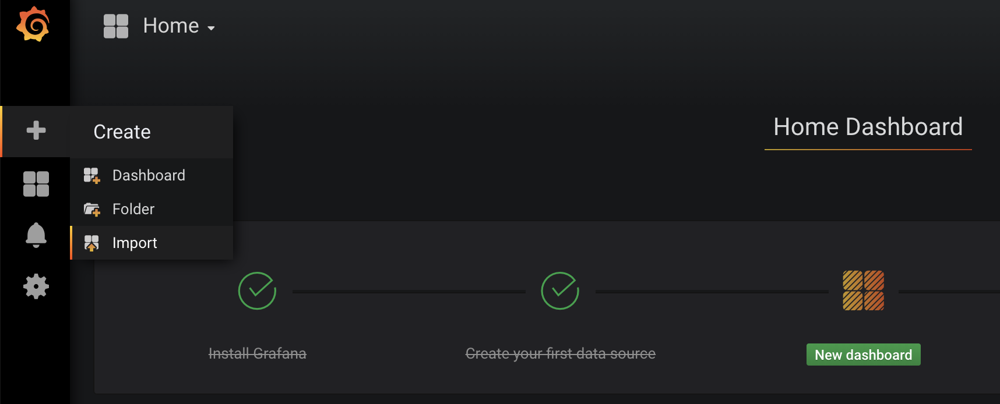
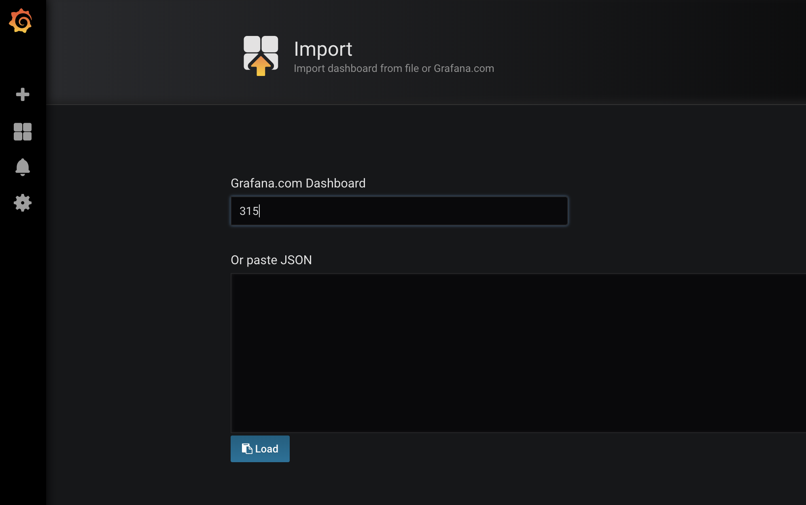
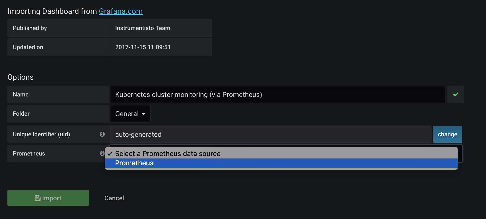

## Installing Prometheus

Make sure you have Helm installed on your Kubernetes cluster. Then use it to install Prometheus using Chart and custom values from [prom-values.yaml](prom-values.yaml) file

```
helm install --name prom stable/prometheus -f prom-values.yaml
```

## Installing Grafana

In the same way install **Grafana** for visualization. Use [grafana-values.yaml](grafana-values.yaml) with configuration adjusted to your minikube cluster

```
helm install --name grafana stable/grafana -f grafana-values.yaml
```

Wait untill all Prometheus and Grafana components are ready - you can monitor it with kubectl

```
kubectl get pod -w
```

## Configuring Grafana dashboard for Kubernetes

Access your Kibana using [http://grafana.192.168.99.100.nip.io](http://grafana.192.168.99.100.nip.io) with **admin** user and password **admin**.

Now import dashboard - use left panel and choose **Import option**



Type **315** (ID of dashboard - [https://grafana.com/dashboards/315]https://grafana.com/dashboards/315)) in **Grafana.com Dashboad ID** window



Select **Prometheus** as Prometheus source in dashboard configuration window



Click **Import** and enjoy your Kubernetes Monitoring dashboard!
